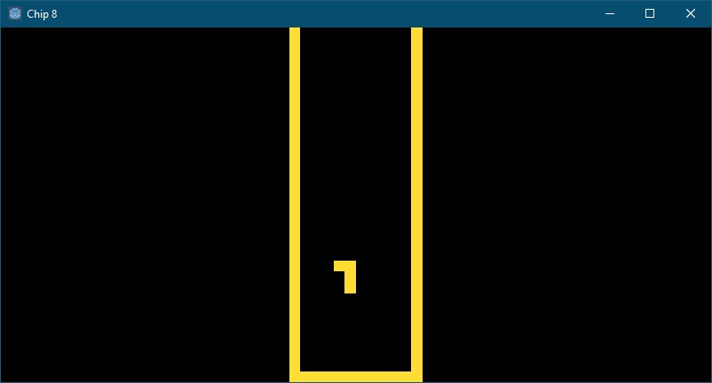

# Godot CHIP8 Emulator

## Description
Godot CHIP8 is a project based on the tutorial series of [Johnnei](https://www.youtube.com/channel/UCYhFBtjJcFzp-HqQF0SRhhg) and [http://www.multigesture.net/articles/how-to-write-an-emulator-chip-8-interpreter/](http://www.multigesture.net/articles/how-to-write-an-emulator-chip-8-interpreter/).

## How to use
Juse use the scene `res://Scenes/Chip8.tscn (Chip8)` on your project, you can change the Scene Variables to your project.